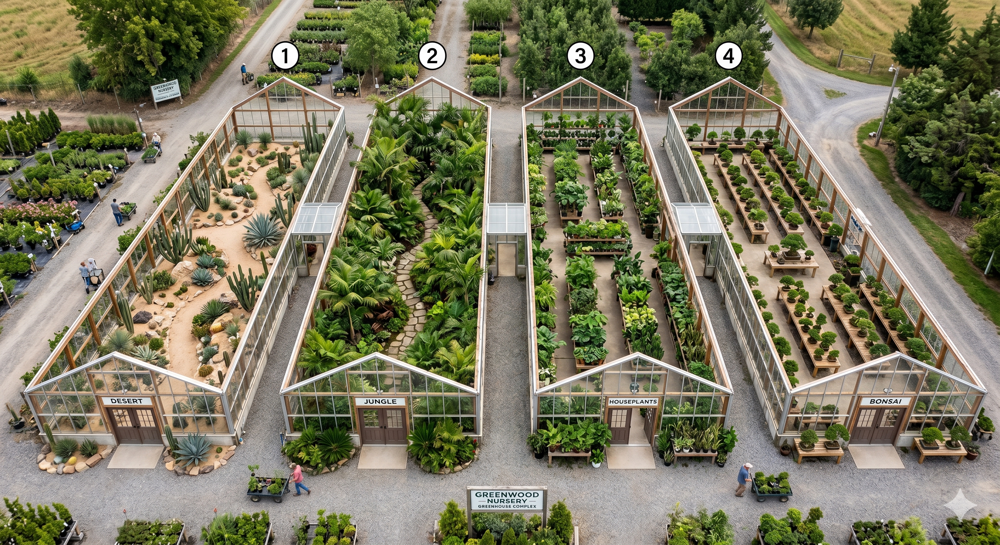

# LLM Greenhouse World Testing

An LLM test to create a 3D, first-person walkable world from a single reference image of a greenhouse complex. Each model receives the same prompt plus `prompt-image.png` and is expected to produce a browser-based 3D scene you can walk through and interact with.

Sister project: [llm-testing-tower-defense](https://github.com/wlinville/llm-testing-tower-defense) (same idea, different domain).

## The Prompts

### Prompt used to generate the reference image
> Create an image of a series of 4 connected greenhouses. It should be at a top down view with the roof removed. 45 degree angle. Each should be a long greenhouse like at a plant nursery. Each should have its own theme: Desert, Jungle, House Plants, and Bonsai. There should be doors on the front and they should connect with tunnels between them.



### Prompt given to each model (along with the image above)
> Create a 3D world/level that I can first person walk through based on the greenhouse image provided (prompt-image.png). It should be web browser based. It can have a web server or just be self contained in a single HTML file. I should be able to interact with elements in the world. Write a document on how to run it and the controls.

Extra prompts were allowed to get a project into a running state, but they degrade the **One-Shot Quality** score.

## Project Structure

```
llm-testing-greenhouse-world/
├── README.md (this file)
├── prompt-image.png (reference image given to each model)
└── {model-name}/
    ├── index.html or greenhouse.html
    ├── README.md or HOW_TO_RUN.md (model-generated)
    └── results/
        ├── results.md (evaluator notes)
        └── *.png (screenshots)
```

## Scoring Methodology

Each tested model is scored across 8 categories totaling 100 points:

| Category | Points | What it measures |
|----------|-------:|------------------|
| Visual Fidelity | 15 | How closely the world matches the reference image (4 greenhouses, layout, tunnels, themes) |
| World Completeness | 15 | All 4 themed greenhouses populated with appropriate plants, doors, signage |
| Navigation | 15 | First-person controls feel right — WASD, mouse look, pointer lock, run/jump |
| Interactivity | 15 | Clickable/usable elements — doors open, plants give info, signs readable |
| Collision / Physics | 10 | Walls block movement, you can't clip through the world |
| Visuals / Polish | 15 | Lighting, materials, plant geometry, HUD, minimap, overall look-and-feel |
| Documentation | 5 | Clear instructions to run and controls reference |
| One-Shot Quality | 10 | Worked from the initial prompt without fixups (deduct for extra prompts needed) |

## Tested Models

<table>
  <thead>
    <tr>
      <th>Model</th>
      <th>Fid<br/>/15</th>
      <th>Comp<br/>/15</th>
      <th>Nav<br/>/15</th>
      <th>Int<br/>/15</th>
      <th>Col<br/>/10</th>
      <th>Vis<br/>/15</th>
      <th>Doc<br/>/5</th>
      <th>OneShot<br/>/10</th>
      <th>Total</th>
    </tr>
  </thead>
  <tbody>
    <tr>
      <td>Claude Opus 4.7 (Claude Code)</td>
      <td>10</td><td>13</td><td>14</td><td>14</td><td>7</td><td>13</td><td>5</td><td>9</td><td><b>85</b></td>
    </tr>
    <tr>
      <td colspan="10"><em>Built and self-tested in ~15 minutes. Greenhouse walls have real collision — you can't walk through them — and doors must be clicked to open. Every plant is clickable and returns an info popup (watering cans and a GREENWOOD NURSERY entrance sign were added as bonus interactivity). Loses points because greenhouses are in <b>reverse order</b> vs. the reference, there are <b>no connecting tunnels</b>, and interior props (benches, plants) have no collision so you can walk through everything inside. Controls and run instructions well documented in <a href="opus-4.7-claude-code/README.md">README.md</a>. <a href="opus-4.7-claude-code/results/houses-in-reverse-order.png">Houses in reverse order</a> · <a href="opus-4.7-claude-code/results/no-tunnel.png">No tunnels</a> · <a href="opus-4.7-claude-code/results/walk-through-everything-in-greenhouse.png">Walk-through interior</a></em></td>
    </tr>
    <tr>
      <td>Claude Sonnet 4.6 (Claude Code)</td>
      <td>9</td><td>11</td><td>13</td><td>6</td><td>2</td><td>11</td><td>5</td><td>6</td><td><b>63</b></td>
    </tr>
    <tr>
      <td colspan="10"><em>Initial run crashed with a <code>TypeError: number -6.25 is not iterable</code> in the render loop; required one follow-up prompt to fix (hence the One-Shot deduction). After the fix the scene is a fun rendition — added a minimap in the bottom-right that shows facing direction, plus benches scattered around. However doors ended up on the <b>back</b> of the houses, the <b>bonsai trees are oversized</b>, nothing is actually clickable (only mouseover tooltips), and you can walk through <b>everything</b> including walls. Run instructions are in <a href="sonnet-4.6-claude-code/HOW_TO_RUN.md">HOW_TO_RUN.md</a>. <a href="sonnet-4.6-claude-code/results/desert-house.png">Desert</a> · <a href="sonnet-4.6-claude-code/results/bonsai-house.png">Bonsai (oversized trees)</a> · <a href="sonnet-4.6-claude-code/results/close-up-walls.png">Walls close-up</a> · <a href="sonnet-4.6-claude-code/results/far-back-shot.png">Far back shot</a></em></td>
    </tr>
    <tr>
      <td>Kimi K2.6</td>
      <td>7</td><td>8</td><td>11</td><td>5</td><td>1</td><td>6</td><td>3</td><td>8</td><td><b>49</b></td>
    </tr>
    <tr>
      <td colspan="10"><em>World loads and is walkable. Greenhouses are <b>squished together</b> with no connecting tunnels and the structure is simpler/more boxy than the reference. Plants show info when pointed at, but nothing else is interactive and the in-world signs have no text rendered on them. No collision at all — you walk straight through walls and structures. Visual style is basic. <a href="kimi-k2.6/results/simple-structure.png">Simple structure</a> · <a href="kimi-k2.6/results/missing-parts.png">Missing parts</a> · <a href="kimi-k2.6/results/walk-through-walls.png">Walking through walls</a></em></td>
    </tr>
  </tbody>
</table>

More models will be added over time.

## How to View Results

1. Clone this repository
2. `cd` into any model directory (e.g. `cd opus-4.7-claude-code/`)
3. Follow that model's `README.md` / `HOW_TO_RUN.md` — some require a local HTTP server (ES module imports), others open directly with `open greenhouse.html`
4. Walk around and interact!

Each model's implementation is completely independent and self-contained within its directory.

## Comparison Notes

Things that varied the most across models:

- **Collision**: the reference image has clearly-defined walls, but most models either implemented no collision at all or only collided with the exterior shell.
- **Interactivity**: the prompt explicitly asks for interaction, but several models stopped at hover tooltips.
- **Tunnels between greenhouses**: no model has yet reproduced the connecting tunnels shown in the reference image.
- **Greenhouse ordering**: only a couple of models match the left-to-right order (Desert → Jungle → Houseplants → Bonsai) from the image.

## Contributing

To add results from a new model:

1. Create a directory with the model name (e.g. `gemini-3-pro/`)
2. Run the same two prompts (image + world) against that model
3. Save the generated files in that directory
4. Add a `results/` subdirectory with `results.md` evaluator notes and screenshots
5. Score it against the rubric above and append a row to the table

## License

Each model's implementation retains its own licensing. This testing project is provided as-is for research and comparison purposes.
